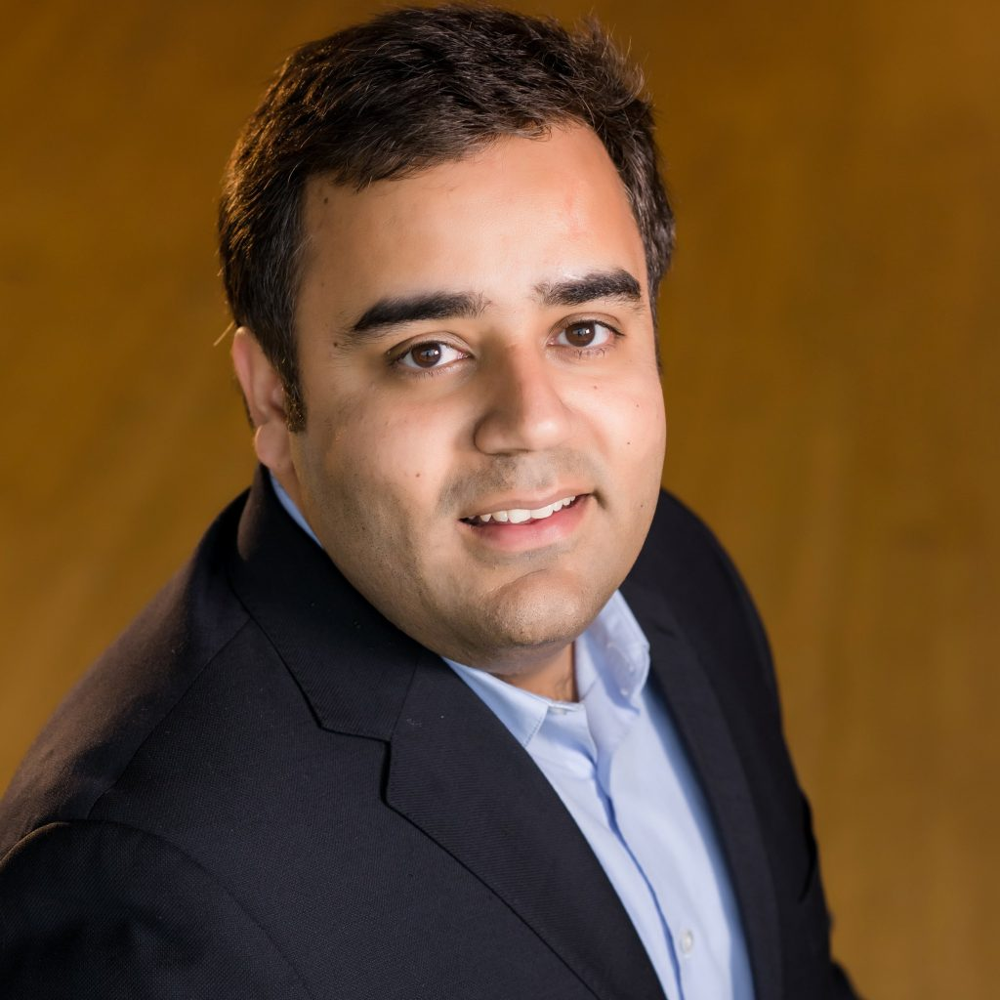

## About

## Dagar Katyal

### Analytics Professional | Technology Enthusiast | Blogger

Dagar is a Data and AI consultant with experience in applying advanced analytics to solve real-world problems. He has consulted for Manufacturing, Travel and Hospitality, Consumer Goods, and Banking organizations on various engagements related to Data Analytics. His focus areas are in consulting are advanced analytics, data warehousing, business intelligence, data governance, BI strategy, data science, machine learning, solution architecture, and cloud-based analytics solutions.  
Dagar has an MBA and Engineering degree from India and has worked with enterprise customers in India, Japan, Canada, and the USA.  
He lives in the Chicago area and loves to spend time with his family

