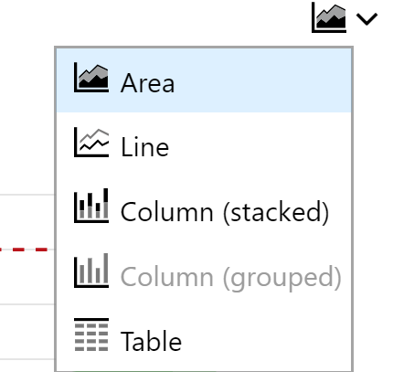

# Cost Management

Cost Management solution in Azure helps in monitoring, optimizing and controlling costs of Azure Resources in the subscription and Resource Groups. Cost Management shows organizational cost and usage patterns with advanced analytics.

There are three main components of Cost Management

Three Components of Azure Cost Management

- **Cost analysis** - _Cost analysis is used to explore and analyze your organizational costs/ aggregated costs by organization to understand where costs are accrued and to identify spending trends. And you can see accumulated costs over time to estimate monthly, quarterly, or even yearly cost trends against a budget_
    
- **Budgets** \- _Budgets help you plan for and meet financial accountability in your organization. They help prevent cost thresholds or limits from being surpassed. Budgets can also help you inform others about their spending to proactively manage costs_
    
- **Recommendations** \- _Recommendations show how you can optimize and improve efficiency by identifying idle and underutilized resources. Or, they can show less expensive resource options_
    

# Cost Analysis

Cost Analysis feature in Azure lets you use Analytics and Visualization to smartly view and monitor the costs in the subscription by resources. The analysis can be done by all resource groups or by a resource group or by a resource.

The usage patterns help the admins to forecast and plan for the resources carefully while keeping a close watch on the budgets defined by the organization

Cost analysis is the in-built analytics on the consumption of the azure resources which capture all the information needed by organization to have a complete view of the costs and spend in Azure.

To access Cost Analysis in Azure user needs to have appropriate access on the costs and subscription/resource group.

## Overview

 

 

In this example the cost analysis has been displayed for a resource group. Go the Subscription/Resource Group on which you want to do cost analysis

Following are the key things that are displayed on the primary tab

**Total** – Shows the total costs for the current month.

**Budget** – Shows the planned spending limit for the selected scope, if available.

**Cost Trend for the Current Month** – Shows the cost spending for the selected month/scope

**Donuts** – Shows the costs break down by various categories such as costs by Service/Location/Resource

## Custom Visuals

The charts can be customized using various Scope available in the analysis section. Each feature provides a customization option to view the costs in a different way. Here are the options available to customize the costs

**Time Scope** provides view of Costs over different time slices as shown below

 

 

**Granularity Scope** provides option to aggregate over period

 

 

**Grouping** Option provides ability to group costs by various factors to do analysis by resource/tags/type etc.

 

 

**Filters** can be added to reduce the scope of the visualization

 

 

**Visualization Type** can be used to customize the view of the visual using variety of inbuild graphs

 

 

## Dashboard

Once the visualization has been customized to suit the need, users can also use the Pin to Dashboard feature to save the visualization and see multiple visualization on the same page on dashboards and then dashboards can be shared across various users in the organization. Below is a sample dashboard with 4 visuals to monitor the costs

 

 

# Budgets

Budgets let you assign a target spend on a cost management group. Budget can be created in based on a subscription or Resource Group. Budgets can be viewed along with the consumption trends over a period to track the usage in comparison the a predetermined spend

Several actions can be configured based on the consumption reaching budgets at a predefined threshold

To create a budget, click on the budget tab on the cost management blade and add Budget. Provide the necessary details to create a budget against a resource management group

## View Existing Budgets

 

 

## Create New Budget

 

 

## View Budget Details

 

 

# Recommendations

Azure Cost Management works with Azure Advisor to provide cost optimization recommendations. Azure Advisor helps you optimize and improve efficiency by identifying idle and underutilized resources

The recommendations can be accessed by clicking the Advisor recommendations tab in the Cost Management Blade

Users can act on the recommendations or can change the rules for recommendations

##  View Recommendations

 

 

## Act on Recommendations

 

 

## Change Recommendation Rules

 

