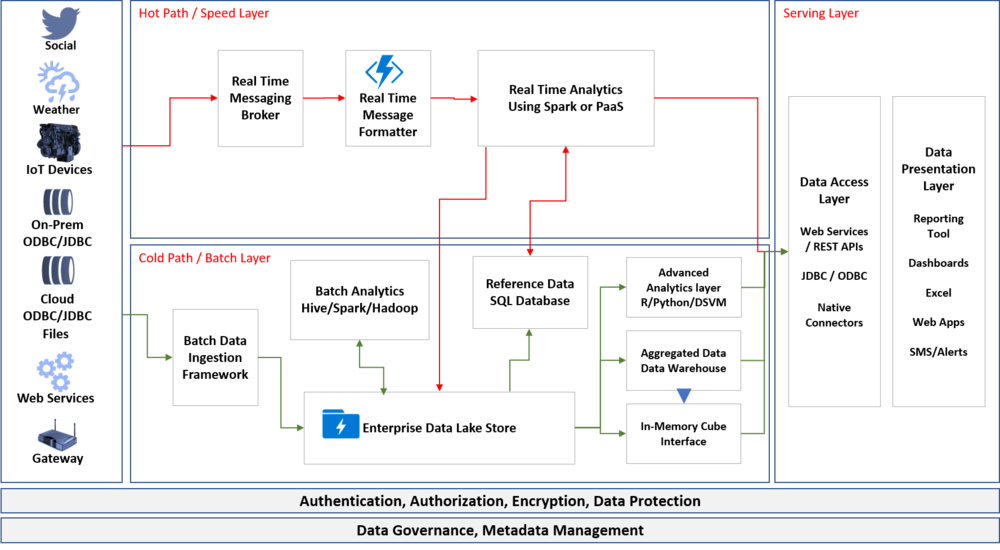

As the data sources grow and the veracity of the data increases, the enterprises have data from both operational systems (ERPs/CRMs) and real time sensors such as IIOT and IIOT devices which can be internal or external. There is also a growing need to process the data in real time for faster insights. Organizations that are re-architecting or re-engineering the analytics solutions on cloud are following familiar pattern of architecture that is called Lambda architecture.

Lambda Architecture provides the capabilities for the organizations to process the data used for analytics in both batch and real-time processing mode. This is a framework which enables a beautiful harmony in the two processing layers and provide guidance on how to consume the data

# Lambda Architecture

Figure 1: Lambda Architecture

Lambda architecture is a data-processing architecture designed to handle massive quantities of data by taking advantage of both batch and stream-processing methods. This approach of architecture attempts to balance latency, throughput, and fault-tolerance by using batch processing to provide comprehensive and accurate views of batch data, while simultaneously using real-time stream processing to provide views of online data. The two view outputs may be joined before presentation.

## Batch Layer (aka Cold Path)

The batch layer pre-computes results using a distributed processing system that can handle very large quantities of data. The batch layer aims at perfect accuracy by being able to process all available data when generating views.

## Speed Layer (aka Hot Path)

The speed layer processes data streams in real time and without the requirements of fix-ups or completeness. Essentially, the speed layer is responsible for filling the "gap" caused by the batch layer's lag in providing views based on the most recent data.

## Serving Layer

Output from the batch and speed layers are stored in the serving layer, which responds to ad-hoc queries by returning pre-computed views or building views from the processed data.

I started this blog to write about the use of Databricks in Lambda Architecture, but I found it useful to cover this in a two part series. Please read the next post about “[Lambda Architecture using Databricks](/blog/2019-7-lambda-architecture-using-databricks)”

I have added another architecture that discussed as part of big data architecture. Read here about [Kappa Architecture](/blog/2019-7-kappa-architecture-another-way-of-data-processing)
