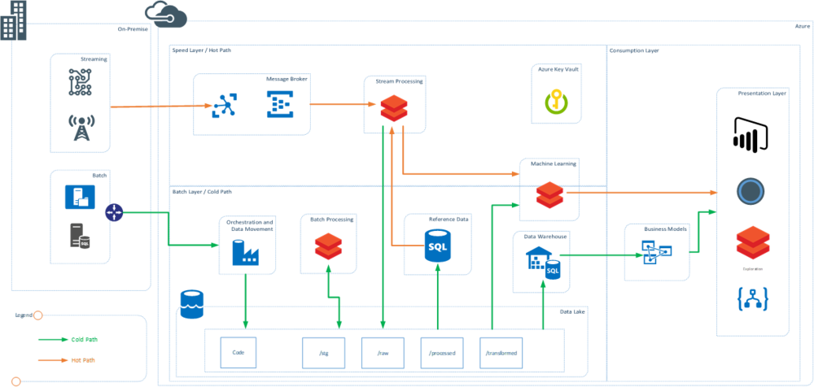

From technology point of view Databricks is becoming the new normal in data processing technologies, in both Azure and AWS. This post provides a view of lambda architecture and uses Databricks at front and center. Databricks has capabilities to replace multiple tools and those are described in bit detail below.

Note: In the post I wanted to focus the use of Databricks in a typical lambda landscape. In order to provide the required details, I have abstracted some of the other aspects of data architecture including Data Governance, Security, MDM, Metadata Management and Data Quality. These are still key functions of data architecture and have to be planned.

# Use of Databricks in Lambda Architecture

Figure 1: Lambda Architecture using Databricks

There are multiple touch points where Databricks can be used and can be a good substitute of the some of the existing technology that enterprises use. The key benefit of using Databricks is that it is a spark-based engine with zero management and using it in multiple places means that the teams needs to be skilled only on one technology. In the above diagram Databricks is used as the main processing engine at various places. This is a representative lambda architecture using Databricks.

## Batch Processing using Databricks

Data bricks can be used as a great data engineering tool and batch processing tool. It uses spark interactive and spark for batch processing using interactive clusters and notebooks. The clusters can be scaled up on demand and the jobs can be orchestrated using external tools by use of APIs. In Azure ADF provides native support for Databricks.

One of the key benefits that Databricks brings is that there are three languages that developers can use. Scala, Python and SQL are all first work citizens in Databricks and that means that learning curve to use the technology is not steep. Use of Databricks delta brings ACID properties to the data lake and makes managing lakes easier

Databricks can potentially play role of:

- ETL and Big Data Tools such as Informatica, SSIS, Hortonworks, Cloudera, EMR (AWS), HDInsight (Azure), Azure Data Lake Analytics (ADLA), Talend, Altreyx
    

## Stream Processing using Databricks

Need of Stream Processing and low latency processing of the data from sources that emit real time information have been quiet popular scenarios in recent past. Using Data Bricks and Spark Streaming this real time processing of data becomes easier and need to separate technology can be avoided. Spark Streaming can subscribe to real time events, process them at low latency while using information from the reference data sources.

Databricks can potentially play role of:

- Real Time Stream Processing technologies such as Apache Storm, Azure Stream Analytics, HDInsight, Striim and Amazon Kinesis
    

(watch out for my blog on demo of structured streaming using Databricks)

## Machine Learning using Databricks

Databricks runs spark and one of the key components of spark is MLib. Organizations can use wide variety of frameworks that are supported in spark and Databricks to create models using distributed compute and using the data stored at any central location. These models can also be used in real-time to generate results from stream. Use of SparkR and PySpark provide distributed parallel processing capabilities which using data scientist familiar languages such as R and Python.

Databricks can potentially play role of:

·        ML Compute and Workbenches such as HDInsight R server, VMs, EC2, Azure Machine Learning Studio, dataiku, and other ML workbenches

## Interactive Exploration using Databricks

This area can be looked at in a variety of ways. Exploration can mean using and consuming prebuilt reports and dashboards. Databricks has capability to do that using the interactive dashboards within notebooks. This is traditionally done using BI and visualization tools

If the enterprise publishes the data into a lake/hub, there is a need to explore and dive into the (data) lake to find out what data can be used for business use cases, self-service discovery and preparation tools come into play. Databricks interactive clusters and notebooks can be used use to query the files in the data lake to explore the data

Data preparation for end consumption is the field, where end users can model the data, prepare the measures and standardize the KPIs. Databricks can be a good platform that can be used by end users and potentially prepare the data for final consumption

Databricks can potentially play role of:

- Data Exploration tools such as Datameer, altryx
    
- Data Visualizations for real-time and dashboard and report sharing with small set of users
    
- Data Preparation and consumption workbench sch as Talend, Trifacta, pentaho
    

Most of the organizations are trying to bring Databricks into their technology equation and use it for at least one of the scenarios mentioned above.
