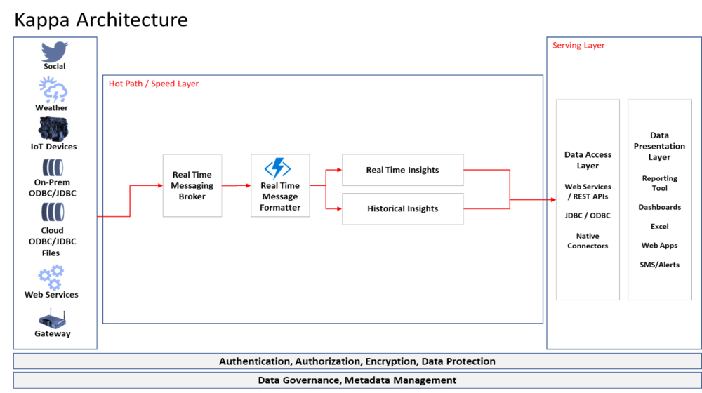

In my previous post I introduced Lambda architecture to process the stream and the batch data within the same stack. Critics argue that Lambda architecture needs the data to be processed twice, once during the speed layer and once in the batch layer. Now, imagine a scenario where we can maintain an immutable persistent stream of data and instead of processing the data twice, we can use the stream to replay the data for a different time using the code. That is the premise of Kappa architecture




Kappa Architecture assumes an immutable persisted stream of data can be leveraged to process the data only once and removes the need for batch layer. This can be achieved by creating a stream of all structured and unstructured data in the organization and persisting it using technology such as Kafka.

The subscribers to the streams can then processed the data for different time windows depending on the use case. The data playback can be handled using the code at the subscriber level. Kafka queue provides TTL (“Time to Live”) and that can be configured to indefinite to keep all the data in the stream.

The main use case for kappa architecture is where there is no need to go back and playback all the data and insights can be driven using the live streams. Machine learning and analytical models can be build using the stream and do not require the historical data for processing. Typical metadata solutions cannot be used for governance since the data cannot be processed at rest. The need of canonical models in the stream becomes important as the data is streamed through multiple sources.

Following are the proposed layers in the Kappa Architecture

## Speed layer aka Hot Path

The speed layer processes data streams in and keeps the queue active for indefinite amount of time. Essentially, the speed layer is double purposed as batch layer and can be configured to playback historical data as per the subscriber. This reduces the overheads of managing and transforming the data twice as compared to the lambda architecture.

## Serving layer

Output from the speed layer can be consumed by various subscribers using serving layer, which responds to ad-hoc queries by returning pre-computed views or building views from the available stream of data.

There is no definitive answer as to which architecture is suitable for an organization. Business case and outcomes define the best suited architecture for the data processing

```
As of this writing public cloud provides do to provide capability to have indefinite TTL in the streams and thus Kappa Architecture is currently not feasible on Azure and AWS.
```
