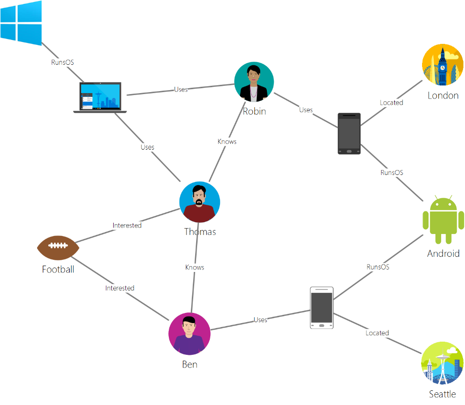

We have all heard about SQL databases and have used either SQL Server, Oracle, MySQL etc for storing or modeling data. The SQL family of databases store data in relational, tabular structures. With the advent of new channels of data generation and consumption, SQL databases sometime don’t provide the most usable patterns for data storage and consumption. Hence the No-SQL databases came into existence. No-SQL are also sometime called Non-SQL/Not Only SQL/Non-relational databses. There are multiple No SQL formats such as document, key-value, graph, and column-family data models. This article talks about the graph models and how it can be used in business context.

When we see entities in real world, we notice that there is a complex relationship occurs between the entities. Every entity type is unique and has multiple possible relationships. Let’s take an example of few entities from daily life. Person, house-hold objects, company, location. Just with these 4 different entities the relationships are huge such as

- Person owns an object (TV)
    
- Person works at a company
    
- Company produces object
    
- Person lives in a city
    
- Person works in a city
    
- Company is located in a city
    
- Person is related to another person
    
- Object is a part of another object
    

Just 4 entities can result in various possible relationships in real world. In traditional world, to get the insights from the data it would have to be modeled in entity form and the relationships would be computed in real time. But this causes challenges in managing complex relationships under its constraints.

Graph databases solve this problem by providing ways to model the relationships in the database and that makes the insights very simple and easy. Graph uses the relationships as the first world citizens in the database and stores the relations along with the data. This is done by using a graph modeling technique that uses the vertices and edges to maintain the relationships as set of key value pairs.

- **Vertices/Nodes** - Nodes or Vertices denote entities, such as a person, a place, or an event.
    
- **Edges** - Edges denote relationships between vertices. For example, a person **knows** another person, person **lives at** a location.
    
- **Properties** - Properties detail the information about the vertices and edges. These properties can be attached to either vertices or edges, and can be used to describe and filter the objects. Example properties include a vertex that has name and age, or an edge, which can have a quantity and/or a price
    

Below example is taken from Microsoft [documentation](https://docs.microsoft.com/en-us/azure/cosmos-db/graph-introduction). This is a simple graph which builds the relationships between entities named people (Robin, Ben, Thomas) and Interests (Football) and Devices and OS and Location.

 

 

In my next article I will model the same data set using Gremlin and Share the code.

## Scenarios for using Graph Databases in Enterprise

Below are few scenarios where organizations can leverage graph databases to model complex relationships

### Customer 360

By combining data about your customers and their interactions with the organizations such as purchase orders, contracts, feedback, services contracts etc. you can develop personalized experiences, predict customer behavior, and look at the 360 degree view of customer.

### Master Data Management

Customer 360 can be extended to Mastering of Customers by understanding the relationships and identifying the potential hierarchy in the customers and ability to deduplicate the customers

### Recommendation engines

Recommendations engines can be built by combining information about products, users, and user interactions, like purchasing, browsing, or rating an item and this is a very relatable use case with retail industry

### Supply Chain Visibility

Supply Chains are getting complex because of global sourcing and global selling. Enterprises see the complex relationship between suppliers, geographies, products, business units and customers. Graph database can model the relationship to achieve better visibility in Supply Chain
