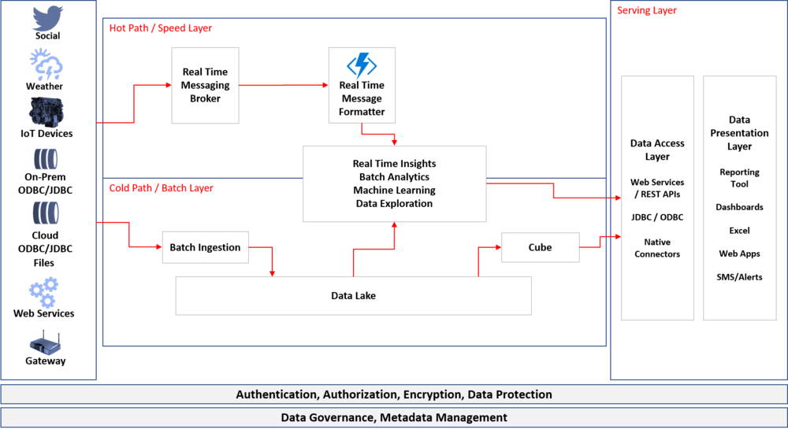

In my previous blogs I have introduced Kappa and Lambda Architectures.  These architectures are big data architectures and designed to support massive amounts of data both in real time and at rest. The key difference between those two architectures is presence of a data lake/ data hub to consolidate all the data at one place. Lambda architecture seems more practical as it uses a cheaper storage media for long term batch processing of the data.

However, the lambda architecture uses HDFS as data lake and the key concept of data lake is immutability. This causes overheads in data processing in the batch layer as the existing data structures can be changed and hence any transformation on the batch layer potentially leads to recreating the data structures.

Delta architecture assumes that any new streaming records are processed like delta (incremental) records and are not processed as new records. Conceptually this architecture patterns is similar to Lambda as it is based on speed and hot path. The one big difference is that delta architecture no longer considers data lake as immutable, and any batch transformation can update the existing data structures in the data lake (process delta records). This capability makes it easier for cold path to be processed.

Below architecture denotes the representation of Delta Architecture and explanation of how Delta Processing works

Representative Delta Architecture

There is a huge benefit given this difference. This bridges the gap between batch and streaming layer and unifies them for seamless processing and lesser overheads. Organizations no longer have to look at the data processing in silos, and don’t have to treat data differently based on the speed of ingestion and processing.

## Delta Processing

Delta in literal sense is also used to denote incremental change (as in Delta in Mathematics). Incremental change in data processing comes from any new data created/updated/streamed since last processing time. The data inserts/ updates can be merged with existing data in the data layer and the file systems files can be updated. The file systems now support CRUD (Create/Read/Update/Delete) operations with the available technology and the file system can be made ACID compliant. The delta technology right now is supported only in Databricks Delta.
