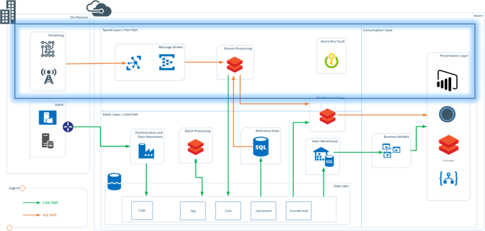

Databricks is becoming the new normal in data processing technologies in cloud, both Azure and AWS. I wanted to create this post on step by step guide to get started on Realtime (streaming) analytics using spark streaming on Databricks

## Architecture

The demo was built to show the speed layer (hot path) of a typical lambda architecture. See highlighted section. ([More on Lambda Architecture in this post](/blog/2019-7-introduction-to-lambda-architecture)). In this architecture, C# application mimics the working of an IOT device.

## Technology:

- C# console application to mimic the streaming events and sending data to Event hubs
    
- Azure event hubs used at message broker and message queue
    
- Azure Databricks to read and process data from Azure Event hubs in real time
    
- Databricks is also used for real time dashboards
    

## Data

Data was sourced from a telematics dataset available at Kaggle [https://www.kaggle.com/yunlevin/levin-vehicle-telematics](https://www.kaggle.com/yunlevin/levin-vehicle-telematics). The headers where removed and some columns were dropped to create the final data set which looked like following. The complete prepared data can be downloaded from here: [Telematics Cleaned Data](https://raw.githubusercontent.com/dagarkatyal/Streaming-To-EventHub/master/StreamData/2.TelematicsData.csv).

## Implementation

### Section 1: Setting up the Resources

Resources were created in Azure account and descriptions explain the settings needed from each file

1. Event Hub Name Space: Name Space to create the Event Hub and used to get the Shared Access Policy Key that will be used in the C# Application (referred as EH\_Key)
    
2. Event Hub: Create an instance of Event Hub in the namespace and note down the name of the Event Hub (referred as EH\_Name)
    
3. Databricks Workspace: Databricks Workspace created to support the cluster and notebooks containing code for real time ingestion
    

### Section 2: Building C# Application as IoT message Generator

C# application uses Azure Libraries to connect to Event Hubs and send the messages in real time. The data file is read and each row is converted to JSON and send to event hubs.

To initialize the Event Hub use the following code and replace the “EventHubConnectionString” with “EH\_Key” and “EventHubName” with the “EH\_Name”

private static EventHubClient eventHubClient;
        private const string EventHubConnectionString \= "Endpoint=sb://eventhhbnamespace.servicebus.windows.net/;SharedAccessKeyName=RootManageSharedAccessKey;SharedAccessKey=T7N2aUpp1WIFHFczw=";
        private const string EventHubName \= "eventhub";

Main method is used to read the number of devices user wants to mimic and uses the data to create the number of devices and send the data

private static async Task MainAsync(string\[\] args)
        {
            var connectionStringBuilder \= new EventHubsConnectionStringBuilder(EventHubConnectionString)
            {
                EntityPath \= EventHubName
            };
            eventHubClient \= EventHubClient.CreateFromConnectionString(connectionStringBuilder.ToString());
            Console.Write("Enter The number of Devices: ");
            string numOfDevices \= Console.ReadLine();
            await SendMessagesToEventHub(System.Convert.ToInt32(numOfDevices));
            await eventHubClient.CloseAsync();
            Console.WriteLine("Press ENTER to exit.");
            Console.ReadLine();
        }

The complete code for the streaming application can be downloaded from the [git repo here](https://github.com/dagrkatyal/Streaming-To-EventHub/tree/master/StreamData).

The above code will be able to stream the data into the event hubs and the console will look like this.

## Section 4: Event Hub

Once the streaming application starts streaming the data, open the Azure portal and check the activity on the Eventhub Name Space. The messages and requests should be actively received. This screen confirms that the messages from the desktop app are successfully going to the eventhubs and the real time messaging has been setup.. YAY!!!!

This was the first part of the 2 part series blog. We have successfully streamed the data into the Event Hubs. This is the same process that is followed for any real time device that is capable of streaming the data and generating stream events.

In the second part I explain how the data that is streaming into the Event hubs is consumed in Databricks for processing.

Read the Blog [Processing Real-time streams in Databricks – Part 2](https://www.thedigitaltalk.com/blog/2019-11-processing-real-time-streams-in-databricks-part-2)
