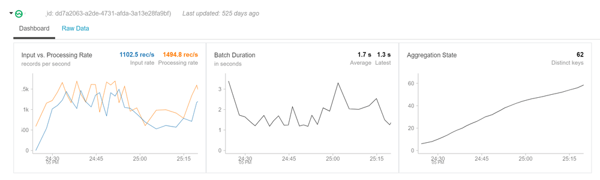

The first part of this post can be found [Processing Real-Time Streams in Databricks – Part 1](https://www.thedigitaltalk.com/blog/2019-10-processing-real-time-streams-in-databricks-part-1)

This is the continuation of the part one, so we will not talk about the architecture and setup that is discussed in part 1. In this section we go the Azure Databricks and create the cluster and notebook to ingest the data in real-time and process and visualize the stream.

## Section 4: Databricks Setup

If this is your first time in the databricks workspace, we need to setup the cluster that can be used to provide the required compute resources to read and process the streaming data. We used a simple 2 node cluster for the POC and we don’t need to install any specific library for this.

 

 

## Connect to the Stream using Notebook

We need to create a notebook to connect to the stream and read the realtime data. Below are the commands for scala notebook

Following imports are needed in the notebook to connect to the event hub and run the sql functions on the data

import org.apache.spark.eventhubs.\_
import org.apache.spark.sql.types.\_
import org.apache.spark.sql.functions.\_

To connect to the event hub, we need to use the connection string and then read then read the stream using spark.readStream

val connectionString \= ConnectionStringBuilder("Endpoint=sb://cncy-eventhhbnamespace.servicebus.windows.net/;SharedAccessKeyName=RootManageSharedAccessKey;SharedAccessKey=TleI7l0meIkzHzfC7N2aUpp0T5U9uRj2oX1WIFHFczw=")
  .setEventHubName("cncyeventhub").build

val customEventhubParameters \=
EventHubsConf(connectionString)
.setMaxEventsPerTrigger(100)

val incomingStream \= spark.readStream.format("eventhubs").options(customEventhubParameters.toMap).load()

we will then define the data structure of the stream and read the stream to the stream dataset

val data \= incomingStream
          .withColumn("Offset", $"offset".cast(LongType))
          .withColumn("EnqueuedTimestamp", $"enqueuedTime".cast(TimestampType)) 
          .withColumn("Body", $"body".cast(StringType))
          .select("Offset", "EnqueuedTimestamp","Body");
//Create a temp table for data
data.createOrReplaceTempView("data");

Data is now a streaming data frame with the columns mentioned above. Body will contain the actual message and other columns are the metadata of the stream. We can add additional scema to the column Body and ready the data in the format we need.

val jsonSchema \= new StructType()
            .add("DeviceID", StringType)
            .add("TimeStamp", StringType)
            .add("gps\_speed", StringType)
            .add("battery", StringType)
            .add("cTemp", StringType)
            .add("dtc", StringType)
            .add("eLoad", StringType)
            .add("iat", StringType)
            .add("imap", StringType)
            .add("kpf", StringType)
            .add("maf", StringType)
            .add("rpm", StringType)
            .add("speed", StringType)
            .add("tAdv", StringType);

val messagesParsed \= data.select((from\_json(col("Body"), jsonSchema)).alias("tmp"))
                                  .select("tmp.\*")
                                  .withColumnRenamed("TimeStamp","DeviceTimeStamp")
                                  .selectExpr("DeviceID", 
                                   "timestamp(from\_unixtime((unix\_timestamp(DeviceTimeStamp, 'M/dd/yyyy hh:mm:ss')), 'yyyy-MM-dd HH:mm:ss')) as DeviceTimeStamp", 
                                   "cast(gps\_speed as int) gps\_speed" ,
                                   "cast(battery as int) battery",
                                   "cast(cTemp as int) cTemp",
                                   "cast(dtc as int) dtc",
                                   "cast(eLoad as int) eLoad",
                                   "cast(iat as int) iat",
                                   "cast(imap as int) imap",
                                   "cast(kpf as int) kpf",
                                   "cast(maf as int) maf",
                                   "cast(rpm as int) rpm",
                                   "cast(speed as int) speed",
                                   "cast(tAdv as int) tAdv"
                                  );

messagesParsed.createOrReplaceTempView("messagesParsed")

when we execute this cell we can see in the execution details that this is messages parsed is a SparkDataFrame.

> Remember Spark has lazy evaluation so no data has been actually read from this stream. This just shows the schema of the data and no data yet

Now when we do query on the dataset we will see that this is a streaming data and we will see the streaming data set

%sql
\--Total Messages Received
select count(1) as 'Total Messages Received' from messagesParsed

This data frame can be used like any structured dataset to query the data. Window functions can be used to group the data and show the data in visual format

select DeviceID, count(1) as 'Number of Messages' from messagesParsed group by DeviceID
// Summary by Device and Tuppling Window
val countsDF \= 
  messagesParsed
    .groupBy($"DeviceID", window($"DeviceTimeStamp", "1 minutes"))
    .count()
 
countsDF.createOrReplaceTempView("countsDF")
%sql select DeviceID, date\_format(window.end, "MMM-dd HH:mm") as TimeWindow, count as 'Number of Messages' from countsDF order by TimeWindow, DeviceID

## Realtime Dashboard

Structured streaming can be used to create a Realtime dashboard in databricks and can be presented to users. Below example was created on the same dataset that I presented.

This was an end to end walkthrough of the structured streaming using Databricks. Please let me know if you have any questions.
