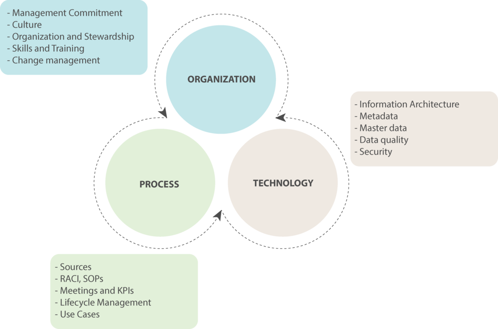

Data governance (DG) has is become one of the key themes of the information management. Data leaders in the corporate organizations are feeling the need of putting the data governance in practice. Changing business models, technology democratization, security and increasing digital assets have made data governance need of the hour. 

This blog establishes a framework and the components that organizations can use to start or improve the DG efforts. 

One of the key point organizations need to consider is that it is sometimes difficult to attach the DG efforts to any business outcome or the analytics initiatives in the organization. While these efforts may not result in any direct business benefit, they do influence the success of all the data initiatives and efforts in the organization. This is the base capability that needs to be built and its recommended to keep these efforts in mind for any upcoming or ongoing programs that are centered around data.

 

Spheres of Data Governance

 

Following are the three aspects that organizations need to consider in any successful governance efforts. See figure above – Data Governance Framework. These three broad aspects are labeled as three spheres of Data Governance.

## Organization Sphere

Organization refers to the people part of the enterprise and the part that I consider most important in the DG journey. This is the “Who” part of the framework. Success of any efforts including the data governance are based on the readiness of the organization. These efforts are implemented at the grassroots levels where rubber meets the road, but the commitment from the top leadership and sponsors directly impact the success of the efforts.

The commitment from the management and readiness of the organization to embrace the need and change are the key areas that enterprises need to focus on when starting the data governance journey.

## Process Sphere

This is the “How” part of the framework. Process sphere refers to the key elements that organizations can use to implement a successful DG structure. The focus is on where data is generated, how it needs to be processed, what are the tollgates that data will pass through and how it will impact the data supply chain are the key influencers in this sphere. The measurement of the DG process is also important and there needs to be defined qualitative and quantitative success criteria. 

## Technology Sphere

This is the “What” part of the framework. The sphere is also referred as architecture components or the tools and technologies that need to be setup for the success of the initiatives. The information architecture and architecture patterns setup the foundation on how data is being generated, processed and consumed. The architecture components need to be combined with metadata management, master data management, data quality and data security to complete the key aspects of the technology sphere. 

There might be need of specialized tools in each of the components of this sphere that might need additional cap-ex and op-ex commitments. Specialized tools boost and speed up the efforts and needs to be carefully evaluated for the success of the program

To keep the blog short and relevant, these are summarized to provide high level information. The detail of each sphere and the components of each sphere are/will be covered in the dedicated blogs that follow.
