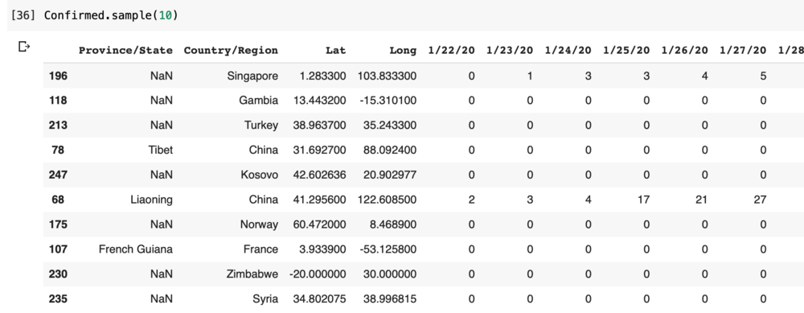
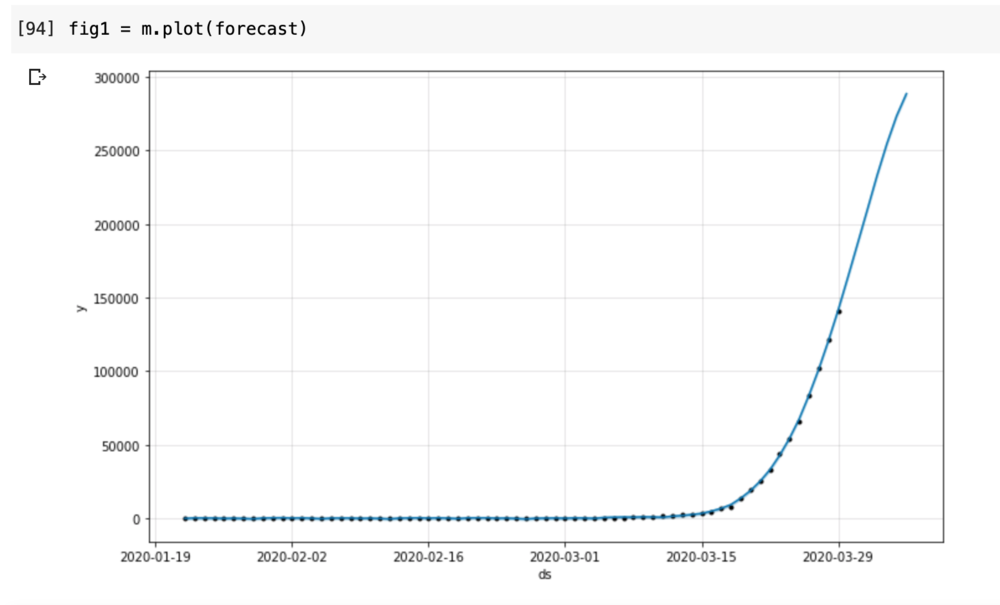

I have been playing with the COVID-19 data since it has been released by Johns Hopkins on Git ([https://github.com/CSSEGISandData/COVID-19](https://github.com/CSSEGISandData/COVID-19))

This data is updated every day from various data sources such as WHO, CDC and health organizations of other countries. 

I have been trying out few different techniques of forecasting the Confirmed Case counts by country. One of the methods I tried was using the Facebook Prophet package that uses timeseries forecasting on the historical data points. 

This blog talks about the how to implement Timeseries Forecasting using Prophet for predicting the number of cases by country. Since I live in US currently, I have taken US to show the plots and data. But this can be used for global data or any country.

## Step 1: Setup 

I have used following setup for this project:

1. Data: Data Repository by Johns Hopkins CSSE ([https://github.com/CSSEGISandData/COVID-19](https://github.com/CSSEGISandData/COVID-19))
    
2. Language: Python
    
3. Package: Prophet
    
4. Compute: Google Colab Research on Google Drive ([https://colab.research.google.com/notebooks/intro.ipynb#recent=true](https://colab.research.google.com/notebooks/intro.ipynb#recent=true))
    

## Step 2: Read the Data

The data I provided by Johns Hopkins on Git and I used Python’s pandas csv reader to read the data. Below is the code for reading the data and how the data looks like. 

#Read The data
import pandas as pd
import csv
import numpy as np
from datetime import datetime, timedelta
import matplotlib.pyplot as plt
from fbprophet import Prophet

baseurl \= 'https://raw.githubusercontent.com/CSSEGISandData/COVID-19/master/'
Confirmed\_url \= 'csse\_covid\_19\_data/csse\_covid\_19\_time\_series/time\_series\_covid19\_confirmed\_global.csv'
Confirmed \= pd.read\_csv(baseurl + Confirmed\_url, sep\=",")

## Step 3: Preparing the data

I have been doing lot of data manipulations across different data sets of confirmed, deaths, recovered patients. However, for ease of this blog I am showing only the transformations I have done on Confirmed cases. 

1. If you see above, some countries have the data by State in the data set and some have null. First step was to fill the missing States value to keep the data cleaner as it might be used later. I have replaced the empty states with the country names
    
2. The data above is a time series data where each date is a column. I had to transpose this data to have single date column and then transform the dates to Date field. 
    
3. This data has the total cases on a particular date. To calculate the daily new cases I created a another transformations using difference between current and previous date and the new column is called Daily\_Confirmed
    

Confirmed\['Province/State'\] \= np.where(Confirmed\['Province/State'\].isnull(), Confirmed\['Country/Region'\], Confirmed\['Province/State'\])

Confirmed \= Confirmed.melt(id\_vars\=\["Province/State", "Country/Region", "Lat", "Long"\], 
        var\_name\="Date", 
        value\_name\="Confirmed")

Confirmed\['Date'\] \= pd.to\_datetime(Confirmed\['Date'\]).dt.date

Confirmed \= Confirmed.sort\_values(by\='Date', ascending\=True)

Confirmed\['Daily\_Confirmed'\] \= Confirmed.groupby(\['Province/State','Country/Region','Lat','Long'\])\['Confirmed'\].diff()

subset \= Confirmed\[Confirmed\['Country/Region'\] \== 'US'\]\[:67\] 

## Step 4: Forecasting 

Note that I have data till 28-March when I did this forecasting and will be forecasting for next 7 days. This data is then filtered for a particular country (US) in this case. Data is prepared for prophet by using certain columns that the model needs and then forecast is generated for next 7 days.

See the code for forecasting using prophet below. If you need to read more about prophet please visit https://facebook.github.io/prophet/

subset \= Confirmed
subset \= subset\[subset\['Country/Region'\] \== 'US'\]
subset \= subset.rename(columns \= {'Date':'ds', 'Confirmed':'y'}) 

m \= Prophet(interval\_width\=0.95)
m.yearly\_seasonality \= True
m.fit(subset)
future \= m.make\_future\_dataframe(periods\=7)
future.tail()

forecast \= m.predict(future)

## Step 5: Visualization

The results viewed as table and are plotted on the graph. The dots are the actual data points and the blue line is the forecast. As per the forecast the number of cases for 29 March will be approx. 141,500

